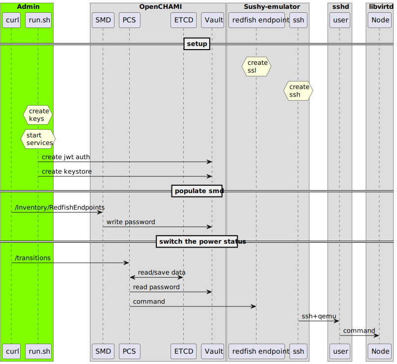

= PCS with Sushy-tools
:toc:
:sectnums:

== Introduction

=== Glossary

PCS:: Power control service
RFE:: Redfish endpoint
SMD:: State management database
https://libvirt.org/[Libvirt]:: is a toolkit to manage virtualization platforms

=== Deployment diagram

(see link:assets/deployment-openchami-testing-environment.plantuml[diagram])

=== Sequence diagram

(see link:assets/sequence-openchami-testing-environment.plantuml[diagram])

=== https://docs.openstack.org/sushy-tools/latest/user/dynamic-emulator.html[Sushy-emulator]

Sushy-emulator run from a docker and connect to the libvirt deamon running on the host machine to handle the virtual node.

==== SSL

Inspired by https://github.com/OpenCHAMI/csm-redfish-interface-emulator[CSM-RIE], we add SSL keys to switch `http` to `https`.

==== SSH

The connection to libvirtd is possible with `"qemu+ssh://user@machine/system"`.

==== htpasswd

https://httpd.apache.org/docs/current/programs/htpasswd.html[htpasswd] add an authentification system to the endpoint.

==== Config

The python configuration file add fake storage data on the virtual node.

=== Vault

Vault is required by SMD and PCS.

==== Keystore

SMD and PCS use a key/value store on the path `secret/hms-creds` to save redfish endpoint credentials.

==== JWT auth

JWT authentification is enabled because PCS use JWT (https://stackoverflow.com/a/39239395[RS256]).

==== SMD to vault

SMD authenticate to Vault directly with the root token.

==== PCS to vault

PCS use a token https://www.rfc-editor.org/rfc/rfc7515[JWS] generated by a private key, the public key is added to Vault as a known key.

=== PCS

==== ETCD

PCS needs Etcd.

== Steps

. Deploy a debian 12 +
Recommended specs:
+
[cols="1,1"]
|===
| vCPU
| 4

| Memory
| 16 GB

| nested virtualization
| enabled
|===

. Clone the repository
+
[source, shell]
----
sudo apt update -y
sudo apt install -y jq git
git clone --branch work-in-progress https://github.com/t-h2o/deployment-recipes
ln -s "${HOME}/deployment-recipes/quickstart/" "${HOME}"
cd quickstart
./generate-configs.sh
----

. Setup libvirt with
+
[source, shell]
----
bash libvirt/setup-libvirt.sh
----

. Create a virtual node with
+
[source, shell]
----
bash libvirt/virtual-node.sh
----

. Install docker with
+
[source, shell]
----
bash install-docker.sh
----
+
NOTE: `install-docker.sh` will add the current user in the docker group. +
To avoid permission error: +
Login to the current user (eg: `su $(whoami)`).

. Create sushy-emulator folder
+
[source, shell]
----
bash rfe-sushy-emulator.sh
----

. Run openchami services
+
[source, shell]
----
make run
----

. Add ssh key to sushy-emulator
+
[source, shell]
----
docker exec x1000c0s0b5 bash -c "ssh-keyscan \"$(docker network inspect bridge -f '{{range .IPAM.Config}}{{.Gateway}}{{end}}')\" > /root/.ssh/known_hosts"
----

. Add sushy-emulator as RFE
+
[source, shell]
----
curl -X POST -d '{"RedfishEndpoints":[{
  "ID":"x1000c0s0b5",
  "FQDN":"x1000c0s0b5",
  "RediscoverOnUpdate":true,
  "User":"root",
  "Password":"root_password"
}]}' http://localhost:27779/hsm/v2/Inventory/RedfishEndpoints
----

. Switch state off
+
[source, shell]
----
bash transition.sh x1000c0s0b5n0 force-off
bash transition.sh x1000c0s0b5n0 on
----

== extra

=== Get transition status

----
curl -s localhost:28007/transitions/${TRANSITION_ID} | jq
----

=== Get components list

----
curl --cacert cacert.pem -H "Authorization: Bearer $(<access_token)" https://foobar.openchami.cluster:8443/hsm/v2/State/Components | jq
----

=== Get endpoints

----
curl --cacert cacert.pem -H "Authorization: Bearer $ACCESS_TOKEN" "https://foobar.openchami.cluster:8443/hsm/v2/Inventory/ComponentEndpoints" | jq
----
